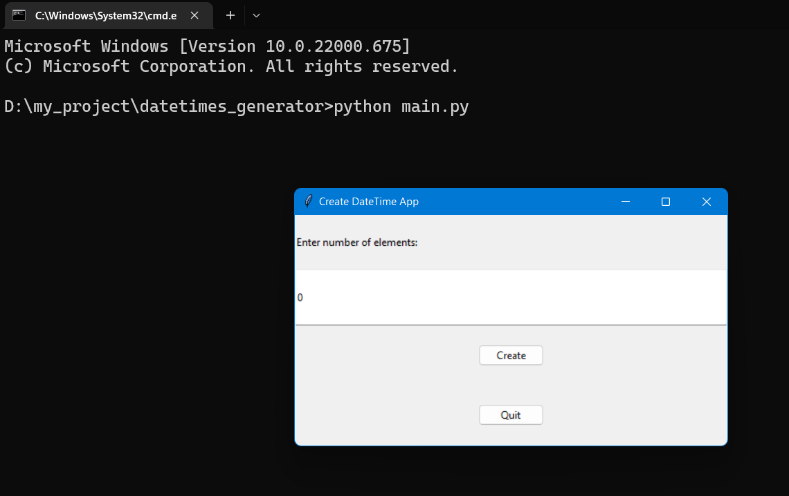

<table>
    <th style="font-size: 30px;"><b>Table of contents</b></th>
    <tr>
        <th style="text-align: center;"><a href="#C1">Introduction</a></th>
    </tr>
    <tr>
        <th style="text-align: center;"><a href="#C2">Installation</a></th>
    </tr>
    <tr>
        <th style="text-align: center;"><a href="#C3">Usage</a></th>
    </tr>
    <tr>
        <th style="text-align: center;"><a href="#C4">Contributing</a></th>
    </tr>
    <tr>
        <th style="text-align: center;"><a href="#C5">Reference</a></th>
    </tr>
</table>

<br>

<h1 style="color: #fff; font-size:30px;" id="C1">Datetime Generator App</h1>

<h2 style="font-weight:Bold">Introduction</h2>
<hr>
<p style="font-size:17px;">In this repo, I would like to introduce a tool that generating datetimes automatically and export it into a csv file. This tool is suitable for you guys about generating your owned datetimes dataset for various circumstances. I hope that it will be useful for you.</p>

<h2 style="font-weight:Bold;" id="C2">Installation</h2>
<hr>
<p style="font-size:17px;">First of all, it's necessary for us to clone this repo into our particular directory.</p>

```bash
$ git clone https://github.com/JosephThien2000/datetimes_generator.git
```
<p style="font-size:17px;">Next, we open our terminal with current directory path and copy-patse this command onto our command line:</p>

```bash
$ python -m pip install -r requirements.txt
```
<p style="font-size:14px;"><i><b>Note:</b> For the reason that this source code needs some python packages installation, please don't skip this part and  upgrade our packages in the future if it's necessary.</i></p>

<h2 style="font-weight:Bold;" id="C3">Usage</h2>
<hr>

<p style="font-size:17px;">Finally, we run this command to open our tool:</p>

```bash
$ python main.py
```
<p style="font-size:17px;">So after run the above command, we would see the console result below:</p>



<h2 style="font-weight:Bold;" id="C4">Contributing</h2>
<hr>

<p style="font-size:17px;">
Pull requests are welcome. For major changes, please open an issue first to discuss what you would like to change. Please make sure to update tests as appropriate.</p>

<h2 style="font-weight:Bold;" id="C5">References</h2>
<hr>

<a href="https://www.programiz.com/python-programming/datetime">https://www.programiz.com/python-programming/datetime</a>

<a href="https://www.adamsmith.haus/python/answers/how-to-get-the-day-of-the-week-from-a-datetime-object-in-python#:~:text=weekday()%20to%20get%20the,is%20Tuesday%2C%20and%20so%20on.">https://www.adamsmith.haus/python/answers/how-to-get-the-day-of-the-week-from-a-datetime-object-in-python#:~:text=weekday()%20to%20get%20the,is%20Tuesday%2C%20and%20so%20on.</a>

<a href="https://help.salesforce.com/s/articleView?id=000325035&type=1">https://help.salesforce.com/s/articleView?id=000325035&type=1</a>